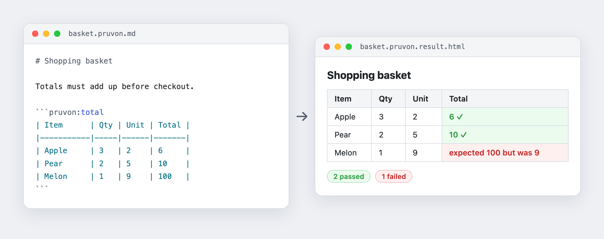
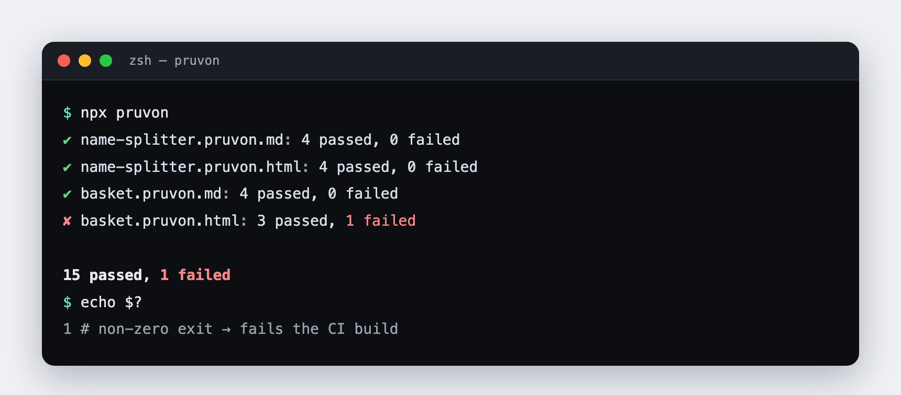

<h1 align="center">Pruvon</h1>

<p align="center">
  <strong>Turn a plain-language spec into an executable, visual test report — for Node.js.</strong>
</p>

<p align="center">
  <a href="https://github.com/fpetitit/pruvon.js/actions/workflows/ci.yml"></a>
  <a href="https://www.npmjs.com/package/pruvon"></a>
  
  <a href="LICENSE"></a>
</p>

<p align="center">
  
</p>

Pruvon is a [Concordion](https://concordion.org)-style BDD tool: you write a **spec** describing
expected behavior as a plain table (HTML or Markdown), pair it with a small **fixture** that wires
each row to your real code, and Pruvon runs it — producing the same document back with every example
colored green or red.

The spec *is* the documentation, the test, and the report. Product owners can read it; your CI can
gate on it.

## Why senior developers reach for it

- **Zero test-framework ceremony.** No `describe`/`it`, no assertion DSL, no config file. A table and
  a function. The engine is ~40 lines of readable async ESM ([`src/run-table.js`](src/run-table.js)).
- **Specs are the source of truth.** Examples live in prose your domain experts can review in a PR,
  not buried in `expect(...)` calls only engineers read.
- **Drops into any Node project.** Plain ESM, TypeScript, or a NestJS app resolving services through
  its DI container — the fixture is just a function, so it doesn't care how your code is wired.
- **CI-native by design.** One process-exit contract, no reporter plugins to install.
- **Tiny, auditable surface.** Three dependencies (`cheerio`, `glob`, `markdown-it`), no build step,
  no runtime magic.

## Install

```bash
npm install pruvon
```

Requires Node.js ≥ 20.

## Quick start

**1. Write a spec** — `basket.pruvon.md`. Each row is one call: every column but the last is an
argument, the last is the expected result. The fence tag names the fixture function to run.

````markdown
# Shopping basket

```pruvon:total
| Item  | Qty | Unit | Total |
|-------|-----|------|-------|
| Apple | 3   | 2    | 6     |
| Pear  | 2   | 5    | 10    |
```
````

**2. Pair a fixture** — `basket.pruvon.fixture.js`. One export per fence tag. Cells arrive as strings;
functions may be `async`.

```js
export function total(args) {
  const [, qty, unit] = args;
  return Number(qty) * Number(unit);
}
```

**3. Run it.**

```bash
npx pruvon
```

<p align="center">
  
</p>

Pruvon writes a `*.pruvon.result.html` report next to each spec, with every result cell colored green
(pass) or red (fail, annotated `expected X but was Y`). Result files are generated output — they're
`.gitignore`d and never hand-edited.

## Features

| | |
|---|---|
| **Markdown *or* HTML specs** | Author in GFM Markdown (` ```pruvon:<fn> ` fenced tables) or raw HTML (`<table data-execute="<fn>">`). Both run through the exact same engine. |
| **Async fixtures** | Fixture functions are `await`ed, so a row can hit a database, call a service, or resolve a DI container before comparing. |
| **CI gate exit code** | `0` when every row of every spec passes, `1` on any failure, thrown fixture, or missing pairing — drop `npx pruvon` straight into a pipeline. |
| **Framework-agnostic** | Ships as pure ESM; works from plain Node, TypeScript, or CommonJS apps. See the NestJS demo resolving a service via `NestFactory.createApplicationContext`. |
| **Isolated rows** | Each row runs in its own try/catch — one throwing or unmatched fixture fails only that row, not the whole spec. |
| **Lifecycle hooks** | Optional `beforeExample`/`afterExample`, `beforeSpecification`/`afterSpecification`, and `beforeSuite`/`afterSuite` — reset state between examples, share a resource across one spec, or set up/tear down once for the whole run. |
| **Zero build** | No transpile step, no linter config, no plugins. |

## How it works

```
 Spec (.pruvon.html / .pruvon.md)  +  Fixture (.pruvon.fixture.js)
                          │
                          ▼
                   pruvon engine
                          │
                          ▼
        Result (.pruvon.result.html) — green / red
```

Discovery globs `**/*.pruvon.{html,md}`, resolving each spec's fixture by naming convention
(`<name>.pruvon.html` and/or `.md` both pair with `<name>.pruvon.fixture.js`). Markdown is rendered to
HTML first; from there HTML and Markdown specs share one execution path.

## Writing specs in detail

### HTML specs (`*.pruvon.html`)

A table's `data-execute` attribute names the fixture function called for each of its rows.

```html
<table data-execute="sum">
  <tr><th>Operand 1</th><th>Operand 2</th><th>Result</th></tr>
  <tr><td>0</td><td>1</td><td>1</td></tr>
</table>
```

### Markdown specs (`*.pruvon.md`)

GFM tables can't carry a `data-execute` attribute, so wrap the table in a fenced block tagged
`pruvon:<fnName>`:

````markdown
```pruvon:sum
| Operand 1 | Operand 2 | Result |
|---|---|---|
| 0 | 1 | 1 |
```
````

Everything else in the file (headings, paragraphs, other code blocks) renders as normal Markdown, so
a spec doubles as living documentation.

### Fixtures (`*.pruvon.fixture.js`)

An ES module exporting one function per `data-execute` / fence name. Each function receives the row's
argument cells as an array of strings and returns (or resolves to) the value compared against the last
cell:

```js
export function sum(args) {
  return args.map(Number).reduce((a, b) => a + b, 0);
}
```

## Lifecycle hooks

A fixture (or, for the suite scope, a dedicated file) can export optional hook functions that run
around your examples. All of them may be `async`; none are required — an undeclared hook is simply
skipped.

| Hook | Runs | Declared in | Example |
|---|---|---|---|
| `beforeExample` / `afterExample` | Once per table row | the spec's fixture | [`examples/before-after-example/`](examples/before-after-example/) |
| `beforeSpecification` / `afterSpecification` | Once per spec file, around *all* of its tables | the spec's fixture | [`examples/before-after-specification/`](examples/before-after-specification/) |
| `beforeSuite` / `afterSuite` | Once for the whole run, around every spec | `pruvon.suite.js` at the `--cwd` root | [`examples/before-after-suite/`](examples/before-after-suite/) |

### Per-example: `beforeExample` / `afterExample`

Called before/after each row's fixture function, useful for resetting state so examples don't leak
into one another. `afterExample` always runs, even if the row's function throws.

```js
export function beforeExample({ fnName, args }) {
  cache.clear();
}

export function afterExample({ fnName, args, actual, passed, error }) {
  // e.g. tear down a per-row stub
}

export function record(args) { /* ... */ }
```

If either hook throws, only that row fails — the same isolation as a throwing fixture function.

### Per-specification: `beforeSpecification` / `afterSpecification`

Called once for a whole spec file, before its first table runs and after its last one finishes —
handy for a resource that's expensive to set up but safe to share across every table in that file
(e.g. seeding an in-memory catalog once instead of per table).

```js
export function beforeSpecification() {
  db.open();
  db.seed(fixtures);
}

export function afterSpecification() {
  db.close();
}
```

If either hook throws, the whole spec is reported as errored (like a missing fixture pairing), and
none of its rows are counted as passed or failed.

### Per-suite: `beforeSuite` / `afterSuite`

A run's "suite" spans every spec `pruvon` discovers — potentially many independent fixture files — so
this hook isn't declared on a fixture. Instead, drop an optional `pruvon.suite.js` at the directory
passed as `--cwd`:

```js
// pruvon.suite.js
export function beforeSuite() {
  server.start();
}

export function afterSuite() {
  server.stop();
}
```

It's loaded once, before any spec is discovered. If `beforeSuite` throws, no spec runs at all; `pruvon`
prints `✗ suite hook failed: <message>` and exits `1` without writing a report. `afterSuite` always
runs after every spec finishes, even if one of them failed.

## CLI

```bash
npx pruvon [options]
```

| Option | Description |
|---|---|
| `--cwd <dir>` | Directory to discover specs from (default: current directory). |
| `--pattern <glob>` | Glob for spec files (default: `**/*.pruvon.{html,md}`). |
| `--help` | Show usage. |

**Exit code** is `0` if every discovered spec's every row passed (or no specs were found), and `1` if
any row failed, any fixture threw, or any spec had no paired fixture — making it a drop-in CI gate.

## Examples & demos

- **[Tutorial](docs/tutorial.html)** — a full illustrated walkthrough of the discuss → document →
  instrument → code loop.
- **[`examples/`](examples/)** — `basket/` (arithmetic, one fixture paired to both an HTML *and* a
  Markdown spec), `name-splitter/` (the Concordion getting-started example), and the three
  [lifecycle hooks](#lifecycle-hooks) demos (`before-after-example/`, `before-after-specification/`,
  `before-after-suite/`) — all running against this repo's engine source directly.
- **[`demos/standard-project`](demos/standard-project)** — a minimal plain-ESM Node project that
  installs `pruvon` from npm like a real consumer would.
- **[`demos/nestjs`](demos/nestjs)** — a CommonJS NestJS app whose fixture resolves a service through
  Nest's DI container, showing Pruvon works regardless of the host project's module system.

## Contributing

Run the engine's own test suite with `npm test` (Node's built-in test runner — no external framework).

## Reports

Every run writes a `pruvon-report.html` in `<cwd>`, listing every discovered spec with its pass/fail
count and a link to that spec's own `*.pruvon.result.html` — one file to open instead of one per
spec. Like the per-spec result files, it's generated output (`.gitignore`d), regenerated on every run.

## Tracking results in git

By default, `*.pruvon.result.html` and `pruvon-report.html` are generated output — you're expected to
`.gitignore` them and regenerate on every run. If you'd rather have the latest pass/fail state visible
just by browsing the repo on `main` (no CI run needed), commit specific result files instead: remove
them from your `.gitignore` (or add a `!` negation for just the ones you want tracked), then run
`pruvon --track-results` to get a warning listing any result file that's still being caught by
`.gitignore`. See [`examples/tracked-results/`](examples/tracked-results/) — its
`tracked-results.pruvon.result.html` is committed, so the colored cells are visible straight from
GitHub's file view.

## Continuous Integration

Running under GitHub Actions (i.e. when `$GITHUB_STEP_SUMMARY` is set) also appends a pass/fail table
to the run's [Job Summary](https://docs.github.com/en/actions/using-workflows/workflow-commands-for-github-actions#adding-a-job-summary),
visible directly on the run's page — no flag needed. GitHub sanitizes raw HTML/inline styles in Job
Summaries, so this is a plain Markdown table (✅/❌ per spec) rather than the colored `pruvon-report.html`;
upload `pruvon-report.html` and the `*.pruvon.result.html` files as a build artifact (e.g. via
[`actions/upload-artifact`](https://github.com/actions/upload-artifact)) alongside it to keep the full
colored report browsable from the run too.

## Contributors

[@francoispetitit](https://twitter.com/francoispetitit)

## License

[MIT](LICENSE)
